# Infrastructure & Application Deployment Pipeline


## 🚀 Overview
A production-ready Jenkins pipeline for secure infrastructure provisioning, cost optimization, and blue-green application deployment on AWS EKS. Implements security scanning, cost estimation, and zero-downtime deployments.

## 📊 Pipeline Architecture

```
┌──────────────────────────────────────────────────────────────────────────┐
│                    Infrastructure Deployment Pipeline                    │
├──────────────────────────────────────────────────────────────────────────┤
│                                                                          │
│  🔒 Security Scan → 📝 Terraform Plan → 💰 Cost Estimation →            │
│  ✅ Manual Approval → ⚡ Terraform Apply → 🌐 Ingress Setup →            │
│  🎯 Blue-Green Deployment → 📧 Notifications                             │
│                                                                          │
└──────────────────────────────────────────────────────────────────────────┘
```

## 🔄 Pipeline Workflow

```mermaid
graph LR
    Start([Pipeline Start]) --> S1[🔒 Security Scan<br/>Trivy IaC Scanning]
    S1 --> S2[📝 Terraform Plan<br/>Infrastructure Planning]
    S2 --> S3[💰 Cost Estimation<br/>Infracost Analysis]
    S3 --> S4{✅ Manual Approval<br/>Infrastructure Changes}
    S4 -->|✅ Approved| S5[⚡ Terraform Apply<br/>AWS Resource Creation]
    S4 -->|❌ Rejected| Stop[⏸️ Pipeline Paused]
    S5 --> S6[🔧 Kubeconfig Setup<br/>EKS Cluster Access]
    S6 --> S7[🌐 Ingress Configuration<br/>SSL/TLS Setup]
    S7 --> S8[🎯 Blue-Green Deployment<br/>Zero-Downtime Update]
    S8 --> End([Pipeline Complete])
    End --> N1{📊 Final Status}
    N1 -->|✅ Success| Email1[📧 Success Notification]
    N1 -->|⚠️ Unstable| Email2[📧 Unstable Notification]
    N1 -->|❌ Failure| Email3[📧 Failure Notification]
    
    style Start fill:#e3f2fd
    style S1 fill:#fff3e0
    style S2 fill:#e0f7fa
    style S3 fill:#e8f5e8
    style S4 fill:#fff8e1
    style S5 fill:#e0f7fa
    style S6 fill:#e3f2fd
    style S7 fill:#f3e5f5
    style S8 fill:#fce4ec
    style End fill:#c8e6c9
```



## 🏗️ Pipeline Stages


### **Stage 1: Infrastructure Security Scanning**
- **Tool**: Trivy
- **Purpose**: Scan Terraform code for security vulnerabilities
- **Output**: `terraform-code-security-scan.txt`
- **Behavior**: Marks build as UNSTABLE if vulnerabilities found (doesn't fail)

### **Stage 2: Terraform Planning**
- **Actions**: `terraform init`, `validate`, `plan`
- **Output**: `tfplan` and `tfplan.json`
- **Purpose**: Preview infrastructure changes before application

### **Stage 3: Infrastructure Cost Estimation**
- **Tool**: Infracost
- **Purpose**: Estimate AWS infrastructure costs
- **Output**: `infracost-report.txt`
- **Credentials**: Requires Infracost API key

### **Stage 4: Manual Approval Gate**
- **Timeout**: 30 minutes
- **Purpose**: Human verification of infrastructure changes
- **Action**: Review Terraform plan before application

### **Stage 5: Infrastructure Application**
- **Actions**: `terraform apply`, EKS cluster setup
- **Outputs**: Cluster name, certificate ARN
- **Post-Cleanup**: Removes temporary plan files

### **Stage 6: Kubernetes Ingress Setup**
1. **Docker Registry Secret**: Configure image pull credentials
2. **Ingress Deployment**: Set up ALB Ingress Controller with SSL
3. **Domain**: Frontend accessible at `https://devops-portfolio.site`

### **Stage 7: Blue-Green Application Deployment**
- **Services Supported**:
  ```
  adservice, cartservice, checkoutservice, currencyservice, emailservice,
  frontend, paymentservice, productcatalogservice, recommendationservice,
  redis-cart, shippingservice
  ```
- **Method**: Zero-downtime deployment using blue-green strategy
- **Automation**: Uses deployment scripts in `k8s/deployments/scripts/`

## 🛠️ Technology Stack

### **Infrastructure as Code**
- **Terraform**: AWS resource provisioning
- **Kubernetes**: EKS cluster management
- **Ansible**: EC2 configuration (if applicable)

### **Security & Cost Tools**
- **Trivy**: Infrastructure security scanning
- **Infracost**: Cloud cost estimation
- **AWS ACM**: SSL/TLS certificate management

### **Deployment & Orchestration**
- **Jenkins**: Pipeline orchestration
- **Kubernetes Ingress**: Traffic routing
- **Blue-Green Scripts**: Automated deployment scripts

## ⚙️ Configuration

### **Required Jenkins Credentials**
1. **AWS Credentials** (`jenkins_aws_access_key_id`, `jenkins_aws_secret_access_key`)
2. **Docker Registry** (`docker_registry_credentials`, `docker_username`, `docker_password`)
3. **Infracost API Key** (`infracost_api_key`)
4. **GitHub Credentials** (for version control)

### **Environment Variables**
```bash
AWS_REGION=ap-northeast-2
AWS_ACCESS_KEY_ID=credentials('jenkins_aws_access_key_id')
AWS_SECRET_ACCESS_KEY=credentials('jenkins_aws_secret_access_key')
DOCKER_CREDENTIALS=credentials('docker_registry_credentials')
INFRACOST_API_KEY=credentials('infracost_api_key')
```

## 📁 Project Structure
```
.
├── Jenkinsfile                    # Main pipeline configuration
├── infra/                         # Terraform infrastructure
│   ├── main.tf                    # Root module
│   ├── vpc.tf                     # Networking
│   ├── eks-cluster.tf             # EKS configuration
│   ├── certificate-manager.tf     # SSL certificates
│   └── outputs.tf                 # Terraform outputs
├── k8s/                           # Kubernetes configurations
│   └── deployments/
│       ├── frontend-ingress.yaml  # Ingress configuration
│       ├── services/              # Service definitions
│       └── scripts/               # Deployment scripts
│           ├── deploy-blue-green.sh
│           ├── switch-slot.sh
│           └── init-blue-green.sh
└── README.md                      # This documentation
```

## 🚀 Quick Start

### **1. Prerequisites Setup**
```bash
# Configure Jenkins credentials
# 1. AWS Access Key ID & Secret Access Key
# 2. Docker Hub credentials
# 3. Infracost API key
# 4. GitHub credentials
```

### **2. Pipeline Configuration**
```bash
# Clone repository
git clone <your-repo>
cd infrastructure-pipeline

# Initialize Terraform
cd infra
terraform init
```

### **3. Create Jenkins Pipeline**
1. **New Item** → **Pipeline**
2. **Definition**: Pipeline script from SCM
3. **SCM**: Git
4. **Repository URL**: Your Git repository
5. **Script Path**: `Jenkinsfile`

### **4. Run Pipeline**
- **First Run**: Will provision infrastructure
- **Subsequent Runs**: Deploy applications with blue-green strategy

## 🔐 Security Features

### **Built-in Security**
1. **Infrastructure Scanning**: Trivy scans Terraform code for security issues
2. **Least Privilege**: IAM roles with minimal required permissions
3. **SSL/TLS**: Automatic ACM certificate provisioning
4. **Secret Management**: Jenkins credentials store for sensitive data

### **Cost Control**
1. **Pre-deployment Estimation**: Infracost provides cost breakdown
2. **Manual Approval**: Human verification of infrastructure costs
3. **Resource Tagging**: Proper tagging for cost allocation

## 🎯 Deployment Strategy

### **Blue-Green Deployment Benefits**
- **Zero Downtime**: Seamless traffic switching
- **Quick Rollback**: Instant revert to previous version
- **Safe Testing**: Test new version before production traffic
- **Service-Specific**: Independent deployment per microservice

### **Supported Services**
The pipeline automatically detects and deploys these services:
- **Frontend**: User interface (`frontend`)
- **Backend Services**: 10+ microservices
- **Databases**: Redis cache (`redis-cart`)

## 📈 Monitoring & Logging

### **Pipeline Outputs**
- **Security Reports**: `terraform-code-security-scan.txt`
- **Cost Reports**: `infracost-report.txt`
- **Terraform Plans**: `tfplan`, `tfplan.json`
- **Build Artifacts**: Archived for each build

### **Kubernetes Monitoring**
```bash
# Check deployment status
kubectl get deployments
kubectl get pods
kubectl get services
kubectl get ingress

# View logs
kubectl logs -f deployment/<service-name>
```

## 🔧 Troubleshooting

### **Common Issues**
1. **Terraform Plan Failures**
   - Check AWS credentials and permissions
   - Verify Terraform state consistency
   - Ensure all required variables are set

2. **Infracost Errors**
   - Verify Infracost API key
   - Check Terraform plan JSON format
   - Ensure AWS pricing API access

3. **Kubernetes Deployment Issues**
   - Verify EKS cluster connectivity
   - Check Docker image permissions
   - Validate ingress configuration

4. **Security Scan Warnings**
   - Review Trivy scan results
   - Address critical vulnerabilities
   - Update Terraform modules if needed

### **Debug Commands**
```bash
# Check Jenkins environment
echo "Cluster: ${EKS_CLUSTER_NAME}"
echo "Certificate: ${CERTIFICATE_ARN}"

# Verify infrastructure
cd infra
terraform output
terraform state list

# Check Kubernetes
kubectl cluster-info
kubectl get namespaces
```

## 📞 Support

### **Pipeline Issues**
- **Jenkins Logs**: Build console output
- **Terraform Logs**: Check CloudWatch or local `.terraform` directory
- **Kubernetes Logs**: Use `kubectl logs` and `kubectl describe`

### **Contact**
- **Build Failures**: Review Jenkins build console
- **Infrastructure Issues**: Check Terraform state and CloudTrail
- **Deployment Issues**: Examine Kubernetes events and pod logs

## 📄 License & Compliance
This pipeline follows security best practices and cost optimization principles. Modify according to your organization's compliance requirements.

---

**Pipeline Version**: 2.0.0  
**Last Updated**: February 2026  
**Maintainer**: DevOps Team  
**Documentation Status**: Current
